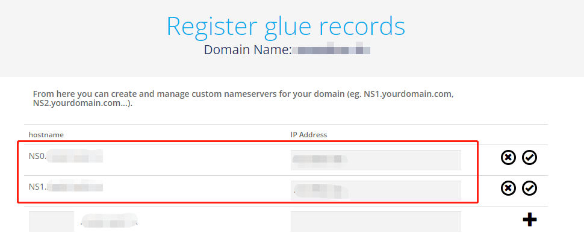
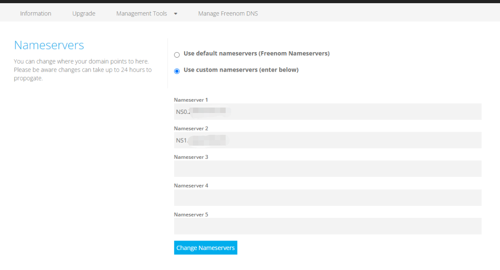

## 一、创建域名及记录


**1、创建域名。添加两条NS记录**



**2、配置DNS使用添加的NS记录**



## 二、脚本使用

### 1、环境


```
python3
Django3
pymysql

pip install requirements.txt 
```

### 2、修改配置文件

Dnslog_web/dnslog_/config.json

```
{
  "info": {
    "NS0.domain.tk": "2.2.2.2[该域名绑定的vsp ip ]",
    "NS1.domain.tk": "2.2.2.2[该域名绑定的vsp ip ]",
    "*": "2.2.2.2[该域名绑定的vsp ip ]"
  },
  "domain": "当前主机所绑定的域名",
  "database":{
	  "user":"数据库用户名",
	  "password":"数据库密码",
	  "host":"数据库IP 默认127.0.0.1",
	  "port":3306,
	  "db":"数据库的用户名"
	  "default_name": "默认用户"
  }
}
```

### 3、运行脚本

1、抓本地53端口,获取信息并传到数据库

```
python3 dnslog.py
```


2、运行web界面，显示信息

```
python3 manage.py runserver IP:PORT

or

python3 manage.py runserver 0.0.0.0:PORT
```


sh脚本

1.sh

```
cd dnslog_
nohup python3 python3 dnslog.py >dns.log 2>&1 &
cd ../
nohup python3 manage.py runserver IP:PORT >web.log 2>&1 &
```


## 三、问题

### 1、53端口被占用

​	查看进程关闭当前服务[systemctl stop systemd-resolved]

### 2、django无法安装

​	查看ping域名是否能ping通，添加dns地址[systemctl start systemd-resolved]
